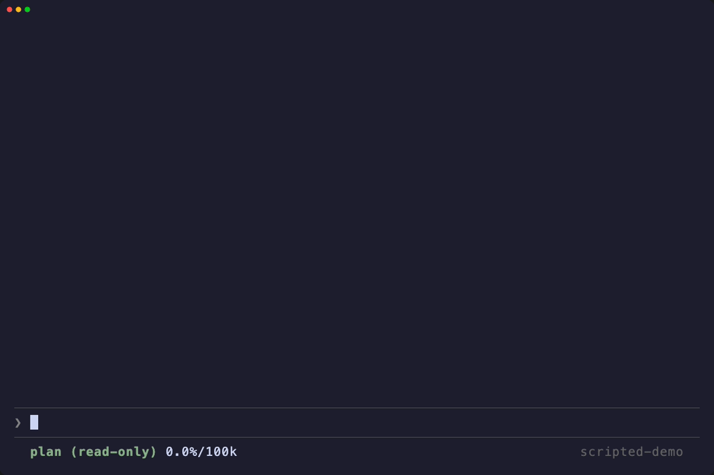

# notagent

A terminal coding agent, written in Rust. It runs as a TUI, talks to LLM
providers over their native APIs, and drives an agent loop with tools for
reading, editing, searching, and running commands.



Scripted model responses; real TUI, file edits and tests.
[Re-record the demo with VHS](scripts/demo/README.md).

## Installation

Version 0.1.57 supports Apple Silicon Macs:

```sh
brew install --cask notagentdev/tap/notagent
```

### Updating

```sh
brew upgrade notagent
```

notagent checks the latest stable GitHub release in the background and shows
this command when an update is available. Results are cached locally for one
hour; failed checks are held for five minutes. Explicit update commands check
GitHub again. It never runs Homebrew or replaces
its own executable.

### Building from source

The required Rust toolchain is pinned by the repository:

```sh
cargo build --release
```

The binary is `target/release/notagent`. Run the complete project gate with
`scripts/check.sh`.

## Why notagent?

**One agent, cache-friendly modes.** Planning and execution stay within the
same long-lived agent, conversation, and cache identity instead of moving to a
separate agent with copied context. Switching modes keeps the shared history
intact and changes only the compact mode-specific instructions and tool
surface, allowing provider prompt caches to reuse matching prefixes rather than
warming a new agent from scratch.

**Cut compactable tool output by at least 50% in the checked workloads.** Two
features reduce the part of the context spent on source reads and shell output:

- *Minified tools.* `read` returns a compact view of a source file:
  comments removed, blank lines dropped, indentation collapsed to one space
  per nesting level. `patch_minified` and `multi_patch_minified` edit through
  that same view — a source map translates the edit back to the real file, and
  nothing is written until every edit succeeds. Surveying and navigating code
  costs a fraction of reading the original source. Set `keep_comments=true`
  when comments or documentation matter. Images are detected automatically;
  `view="original"` requires a concrete `reason`.
- *Bash filter.* Conservative, process-free compaction of shell output before
  it enters the context (`/bash-filter on|off`). Verbose build, test, and
  package-manager output shrinks to what the agent actually needs. The filter
  never loses information: whenever a compaction would be empty, larger than
  the raw output, or uncertain, the raw output passes through untouched.

The regression fixtures use notagent's deterministic four-units-per-token
estimators. A commented Rust source read drops from 15 to 7 estimated tokens
(53%); a 60-test Cargo run drops from 624 to 24 with its full-log pointer
normalized to a stable placeholder (96%). These are reproducible fixture
measurements, not a promise for every input: savings depend on how much
removable structure the input contains.

**Atomic writes in the same branch or worktree.** With `/leases on`, every
mutating file tool takes an advisory, time-bounded lease before it writes
(`.notagent/leases` in the workspace). Several agents working in one checkout
stop overwriting each other: only one holder may modify a file at a time, a
content hash taken at reservation detects a file changed underneath the
holder before the commit, and leases expire on their own so a crashed agent
never blocks a file.

**And the rest:**

- *Goal mode* — `/goal` sets an objective the agent keeps pursuing across
  turns, with optional turn and token budgets.
- *Local code index* — `/index` builds a tree-sitter symbol index the agent
  queries through a dedicated tool instead of grepping blindly.
- *Session tree* — `/fork`, `/clone`, and `/tree` branch and navigate a
  session; `/export` writes HTML or JSONL, `/import` resumes from JSONL.
- *Remote sessions* — a CBOR binary protocol, a Unix-socket session server,
  and SQLite session storage, so a session can outlive the terminal that
  started it.
- *MCP* — `/mcp` lists, adds, inspects, and authenticates MCP servers at
  runtime.
- *Single static binary* — `cargo build --release` and you are done; no
  runtime, no node_modules.

## Update notes

### 0.1.60

- Catalog updates reach installed binaries again. The CDN in front of
  `notagent.dev` answered every catalog refresh with 403, so new models only
  arrived with a new release. Requests to the site now use HTTP/1.1, which it
  lets through.

### 0.1.59

**New models**

- *Claude Opus 5.5* (`claude-opus-5-5`) for the Anthropic API and the Claude
  subscription login: 1M context, 128K output, adaptive thinking up to `max`
  that cannot be switched off, $4 / $20 per million input / output tokens.
- *Claude Fable 5.1* (`claude-fable-5-1`), Anthropic's model for the most
  demanding reasoning: 1M context, 128K output, $10 / $50 per million input /
  output tokens.
- *GPT-6 Sol* (`gpt-6-sol`) and *GPT-6 Luna* (`gpt-6-luna`) for the OpenAI API
  (1.05M context) and the Codex plan (872K context), with reasoning up to
  `max`. Sol costs $2 / $10, Luna $0.10 / $0.50 per million input / output
  tokens; prompts above 272K input tokens are billed at the long-context rate.
- New defaults: `claude-opus-5-5` for the Anthropic API and the Claude
  subscription, `gpt-6-astra` for the OpenAI API and the Codex plan. A model
  chosen explicitly or saved in the settings is kept.
- Claude Sonnet 5.5 and Haiku 5.5 are announced but not yet released; they
  will be added once Anthropic publishes their model IDs.

**Transcript in native scrollback.** On the main screen, finished transcript
entries now go into the terminal's own scrollback once instead of being
re-rendered every frame. Only the part still changing is redrawn, so long
sessions stay fast. The first frame starts at the cursor instead of clearing
the screen. A resize waits until the size settles and then replays a bounded
number of rows. Answers commit whole paragraphs while they stream, so the
final render continues the rows already written and does not repaint them.
Kitty images are removed cleanly before their rows are cleared, and the
fullscreen search scans in chunks instead of stalling on large transcripts.

**Fixes**

- Tool progress, such as the output of a running `bash` call, is shown while
  the tool runs. Before, it arrived only together with the result.
- Umlauts, CJK text, and emoji no longer turn into replacement characters when
  a network chunk cuts a character in half. This affected every provider stream and could
  corrupt file contents that a model wrote. A CRLF split between two
  server-sent event chunks no longer cuts the event in two.
- Large pastes and background task output keep characters that straddle a read
  boundary.
- `grep` and `find` no longer hang when a search hits many unreadable
  directories. `grep` keeps its matches when some paths could not be read, and
  error output is capped before it reaches the model.
- `patch_minified` refuses files that are not valid UTF-8, as `edit` already
  did, instead of rewriting every invalid byte in the file.
- A `settings.json` that stops parsing while notagent runs, for example during
  a hand edit, is no longer overwritten by the next setting change. The change
  stays pending and is saved once the file is valid again. Settings are written
  atomically, and save failures are reported.
- A `bash` command that ignores SIGTERM is killed when it is aborted, even if
  the agent stops waiting for it first.
- The task view reads only the tail of a task's log for its preview instead of
  loading the whole file.
- A session started below earlier shell output no longer paints over it. The
  blinking status marker was placed at an absolute screen row, which moved the
  live area and the input up into the older output.

## Crates

| Crate | Description |
|-------|-------------|
| `notagent` | Interactive coding agent CLI (TUI, slash commands, session handling) |
| `notagent-agent` | Agent runtime: agent loop, tools, queues, custom messages |
| `notagent-ai` | Unified multi-provider LLM API (streaming, auth, model catalog) |
| `notagent-tui` | Terminal UI library with differential rendering |
| `notagent-client` | Transport-neutral protocol client with a lease system |
| `notagent-protocol` | CBOR binary protocol for remote sessions |
| `notagent-server` | Session server core with Unix socket transport |
| `notagent-session-sqlite` | SQLite session storage backend |
| `notagent-telemetry` | Vendor-neutral telemetry contracts (spans, events, attributes) |
| `notagent-index` | Code symbol indexing using tree-sitter |

## Usage

```sh
notagent
```

Everything happens inside the TUI:

- `/login` — pick a provider and store an API key or run an OAuth flow
- `/model` — pick a model (fuzzy search, `/model <provider>/<model>` also works)
- `/leases on|off` — atomic file leases (default: off)
- `/bash-filter on|off` — shell-output compaction (default: off)
- `/index on|off` — the local codebase index
- `/goal <objective>` — goal mode
- `/btw <question>` — ask a side question (see below)
- `/effort` — select the reasoning level
- `/settings` — everything else

## Tool display

In `/settings`, choose **Block style → Badge or Dot**. Dot is the default.
Dot uses plain tool labels with a status dot: dim while queued or running,
green on success, and red on failure or cancellation. Running dots blink
together every 600 ms; they pause while hidden, unfocused, or behind a dialog.
Background launch records and replayed history stay static.

The choice is saved as `blockStyle` and can change during a running command.
An explicit project setting is updated in that project; otherwise the choice
is global. Existing `standard` configurations remain supported.

## Side questions

`/btw <question>` opens a panel above the input and answers there. The question
goes to a forked child that already knows the whole conversation, so nothing has
to be explained to it — but the exchange never enters the conversation itself.
It costs one answer, not a permanent place in every later request.

While the panel is open, a plain line is a follow-up to it rather than a prompt
for the agent; slash commands still work as usual. The arrow keys scroll the
panel once there is more than fits, and Escape closes it. Closing discards the
exchange: what you learned there, the agent does not know.

The child cannot use tools. It answers from what it already knows, and says so
when it does not know.

Providers are also picked up from ambient environment variables
(`ANTHROPIC_API_KEY`, `OPENAI_API_KEY`, …) without a login.

## Local and custom endpoints

Three providers take their model list from a server rather than from a
built-in catalog, so they offer exactly what that server holds:

- **Ollama** — `/login ollama`, pointed at `http://127.0.0.1:11434/v1`.
- **LM Studio** — `/login lmstudio`, pointed at `http://127.0.0.1:1234/v1`.
- **Custom (OpenAI-compatible)** — `/login custom` asks for a base URL, which
  is stored with the credential, so `/logout custom` removes the endpoint
  along with the key. A URL may be typed without a scheme or without `/v1`;
  both are filled in.

The login asks for an API key in every case. On a loopback address the
question can be answered with an empty line, since a local server authorizes
everything until its own authentication is switched on — both runtimes offer
that, and a key typed here is sent as a bearer token from then on.

None of them appear in the model picker until they are activated, and
`/logout` deactivates them again. The model list comes from the server, so it
holds exactly what was pulled or loaded; an address nothing answers on is
reported rather than passed over. Where a runtime reports a model's context
window and whether it reasons, those are used, and the effort levels offered
are the ones that runtime accepts.

## Custom providers (models.json)

Additional OpenAI-compatible providers and models can be declared in
`~/.notagent/agent/models.json`. Entries there are layered over the built-in
catalog: new providers appear in the picker, and known models can be
overridden per field.

The binary also contains a built-in model catalog, so it remains usable
offline. Catalog updates for authenticated providers are fetched from
`notagent.dev` and cached in `~/.notagent/agent/models-store.json`. To force a
refresh without changing the user-owned `models.json`, run:

```sh
notagent update --models
```

The catalog those updates come from lives in this repository under
`api/models/` and is uploaded unchanged to `https://notagent.dev/api/models/`.
It is generated from the embedded catalog in `crates/notagent-ai/data/`. After
changing that, regenerate both with:

```sh
node scripts/import-model-catalog.mjs              # from the embedded catalog
node scripts/import-model-catalog.mjs <directory>  # import a flat provider directory
```

A test fails when `api/models/` no longer matches the embedded catalog.
`scripts/package-macos-release.sh` writes `api/latest-version.json` and packs the
whole `api/` folder into the release's `notagent-api-v<version>.tar.gz`.

## Built-in skills

Four skills ship with the binary and are written once into
`~/.notagent/agent/skills/` on startup, each only if its file does not
already exist:

- `create-plan` — research a task and record an implementation plan under `plans/`
- `execute-plan` — work through a recorded plan task by task, tracking status in the file
- `explore` — read-only investigation with cited findings
- `debug` — systematic debugging discipline: reproduce first, then ranked hypotheses, then the fix

Once on disk they are ordinary user skills: edit them, replace them with your
own of the same name, or delete one to restore the shipped version on the next
start. User skills take precedence over project skills of the same name, as
always. Plan mode asks the model to load `create-plan` unless another planning
skill is already in use, so replacing the planning method means providing a
skill, not editing the mode.

## Permissions & containerization

notagent's permission rules and hooks can refuse agent actions, but they are
not an operating-system security boundary. The process still has the
permissions of the user that launched it. If you need stronger boundaries,
run it in a container or sandbox.

## Hooks

Hooks are shell commands attached to agent lifecycle events. User declarations
live in the agent configuration directory's `hooks.json` (normally
`~/.notagent/agent/hooks.json`). Project declarations are loaded once from
`.notagent/hooks.json` relative to the directory in which notagent was launched;
they are not reloaded when a session uses another working directory. User hooks
run first and project hooks are appended. A file can be a plain array or an
object with a `hooks` array:

Project hook loading is currently independent of project trust. Review
`.notagent/hooks.json` before starting notagent in an unfamiliar checkout,
because its commands may run even when that project has not been trusted.

```json
[
  {
    "event": "PreToolUse",
    "matcher": "write,edit",
    "command": "check-change",
    "timeout_ms": 30000
  }
]
```

```json
{
  "hooks": [
    {
      "event": "SessionStart",
      "command": "record-session-start",
      "timeout_ms": 5000
    }
  ]
}
```

`event` and `command` are required. `timeout_ms` is an integer from 1 through
300000 and defaults to 30000. `matcher` is an exact, comma-separated list of
tool names; `*` matches every tool. It is valid only for `PreToolUse`,
`PostToolUse`, `PostToolUseFailure`, `PermissionRequest`, and
`PermissionResult`. Matchers are not regular expressions. Unknown fields,
empty matchers, invalid timeouts, and matchers on other events reject that
declaration without discarding valid sibling declarations. Exact duplicates
are reported but both still run.

This contract is intentionally strict: the old `timeout` field is invalid and
is not interpreted as seconds or milliseconds.

Every hook receives one JSON object on standard input. All payloads contain
`session_id`, `cwd`, and `hook_event_name`; `transcript_path` is present once a
session has a file on disk. Event-specific fields are:

| Events | Additional fields |
| --- | --- |
| `SessionStart` | `source` |
| `SessionEnd` | `reason` |
| `TurnStarted` | `turn_number` |
| `UserPromptSubmit` | `prompt` |
| `UserPromptQueued` | `prompt`, `queue`, `image_count`, `queue_length` |
| `PreToolUse` | `tool_call_id`, `tool_name`, `tool_input` |
| `PostToolUse`, `PostToolUseFailure` | `tool_call_id`, `tool_name`, `tool_input`, `tool_response` |
| `PermissionRequest` | `tool_call_id`, `tool_name`, `target`, `policy`, `reason`, `mode` |
| `PermissionResult` | `tool_call_id`, `tool_name`, `target`, `policy`, `answer`, `allowed` |
| `TaskStarted` | `task_id`, `kind`, `description`, `detached` |
| `SubagentStart` | `task_id` (null without a task manager), `child_session_id`, `agent`, `alias`, `description`, `prompt`, `detached` |
| `SubagentStop` | `task_id` (null without a task manager), `child_session_id`, `agent`, `alias`, `status`, `duration_ms`, `stop_reason`, `result`, `detached` |
| `PreCompact`, `PostCompact` | `trigger`, `reason`; `PreCompact` also has `custom_instructions` |
| `Stop`, `StopFailure`, `Interrupt` | `stop_hook_active` |
| `Notification` | `notification_type`, `message`, and, for permission prompts, `tool_name` |

Hook commands run sequentially in declaration order. Observational hook chains
run every matching declaration even when one fails. Blocking chains stop at the
first denial or cancellation; an `allow` or `ask` does not suppress a later
denial. `PreToolUse` and `UserPromptSubmit` are blocking; every other event is
observational. Exit code 2 or a timeout refuses a blocking event. On an
observational event, every non-zero exit and every timeout is reported as a
fault instead. Cancelling a turn cancels its hook without manufacturing a
denial. Timeout and cancellation terminate the hook's process tree. `Stop` is
only a notification and cannot continue or restart the agent.

After an ordinary hook exit, a deliberately detached descendant with redirected
standard streams is left running. If a descendant retains the hook's captured
stdout or stderr pipe, the runner waits two seconds for those readers, then
terminates the owned process tree so the hook invocation cannot hang forever.

A decision or explicitly marked context uses exactly one structured-output
shape:

```json
{
  "hook_output": {
    "decision": "deny",
    "reason": "The requested operation is outside the approved path.",
    "context": "Optional context for the model."
  }
}
```

`decision` is optional and accepts `allow`, `ask`, or `deny`; `reason` and
`context` are optional strings. The entire trimmed standard output must be
this JSON document. Mixed log lines followed by JSON are plain output, and
top-level `decision` or `permission` fields are invalid. JSON-shaped malformed
output is reported and refuses a blocking event. On observational events a
decision is reported and ignored. `ask` enters the existing approval flow for
`PreToolUse`, but is invalid and refuses `UserPromptSubmit`.

In the application, only successful output from `UserPromptSubmit` is delivered
to the model as context: plain stdout is used directly, while structured JSON
contributes only its `context` field. Context from `PreToolUse` and
observational events is not injected into the conversation. Stdout and stderr
are each capped at 4000 UTF-16 code units including the truncation marker before
stdout is interpreted. A structured JSON document must therefore fit inside
that captured stdout limit; one cut by the limit is malformed and refuses a
blocking event. Tool responses and subagent result summaries are capped at
2000 UTF-16 code units including their truncation marker. Commands should write
diagnostics to stderr. For an exit-code refusal, structured `reason` takes
precedence, then stderr, then plain stdout.

A read-only prompt guard can reject an oversized submission before it reaches
the transcript or model:

```json
{
  "event": "UserPromptSubmit",
  "command": "jq -e '.prompt | length <= 2000' >/dev/null || { echo 'Prompt is too long' >&2; exit 2; }",
  "timeout_ms": 5000
}
```

An observational hook can append a bounded audit record after a tool finishes:

```json
{
  "event": "PostToolUse",
  "matcher": "write,edit",
  "command": "jq -c '{id: .tool_call_id, tool: .tool_name, success: .tool_response.success}' >> .notagent/hook-audit.jsonl",
  "timeout_ms": 5000
}
```

## Experimental

### MTPLX provider

Support for [MTPLX](https://github.com/youssofal/MTPLX), an MLX inference
server for Apple Silicon with multi-token prediction. This feature is
experimental; the login picker marks it accordingly.

Two instances exist:

- **MTPLX (local)** — built in, pointed at `http://127.0.0.1:8000/v1`.
  Activate it with `/login mtplx` (no key needed on loopback) and deactivate
  it with `/logout`. While inactive it stays out of the model picker.
- **MTPLX (remote)** — declare a second instance in `models.json` with the
  remote base URL; the key comes from the login, `MTPLX_API_KEY`, or the
  config entry.

The model list is fetched live from the server (`/v1/models`), so the picker
offers exactly the model the server is serving. Requests carry a session id
header for the server's session cache and identify themselves as `notagent`,
which keeps sampler control on the client side.

#### Starting the server

Example for a 32 GB machine (M1 Pro/Max) — this is the configuration this
feature was developed against, serving a 27B model with a 131k context:

```sh
mtplx serve --model Youssofal/Qwen3.8-27B-MTPLX-Bare-Speed \
  --paged-kv-quantization q8 \
  --context-window 131072
```

The two flags matter together: `--paged-kv-quantization q8` halves the KV
cache, and `--context-window 131072` caps the pre-allocated KV pool. Without
the cap the server wires the pool for the model's full 262k window, which
saturates a 32 GB machine. Full context needs 48 GB or more.

Note that MTPLX compacts older tool results server-side, so the effective
context stays far below what the raw conversation suggests; the context
percentage in the footer reflects what the server actually processed.

## Acknowledgements

notagent builds on work from [pi](https://github.com/earendil-works/pi).
Thanks to the pi authors for the foundation.

## License

MIT — see [LICENSE](LICENSE). Portions derive from pi (MIT) and from an
Apache-2.0 work; both are recorded in [NOTICE](NOTICE).
